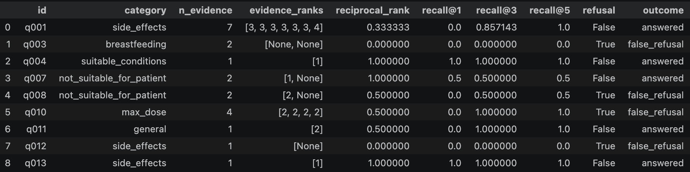
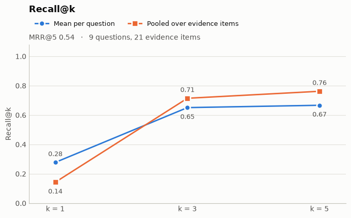
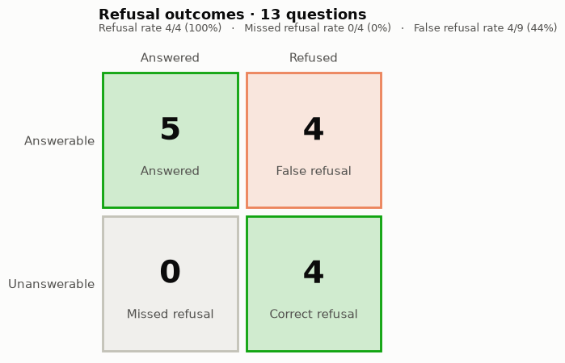
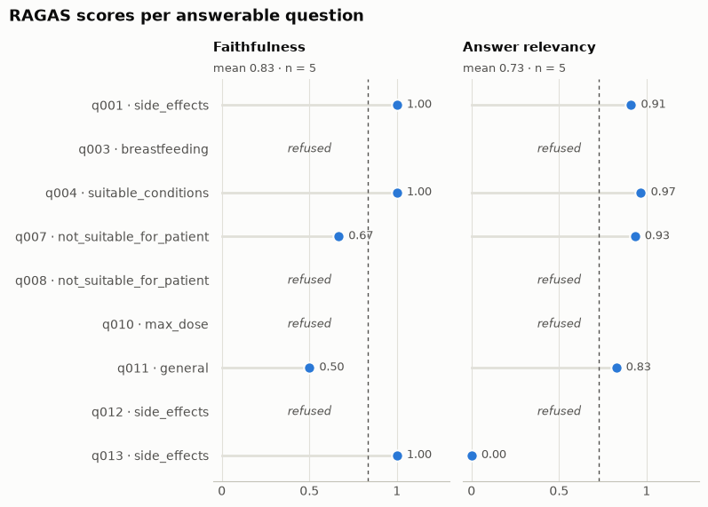

This project is a work in progress.

This project builds a RAG pipeline for UK medicine leaflets.

### Disclaimer

*It's crucial to note that the aim of this project is not to build a fully functional, safe system that can be relied on, but rather to explore the challenges associated with applying RAG and agentic behaviour to a relatively simple and constrained health-related problem space.*

# Repository structure

```
medical_rag/
├── rag_pipeline/                     # Source code for the pipeline and its evaluation
│   ├── config.py                     # All settings: chunking, embedding, retrieval, generation and judge
│   ├── parse_documents.py            # PDF → sections, using Docling's layout-aware parsing
│   ├── chunking.py                   # Sections → chunks, with medicine name and section heading added
│   ├── vector_store.py               # Build a Chroma vector store
│   ├── retrieval.py                  # Embeds a query and returns the top-k chunks
│   ├── generation.py                 # Prompt and LLM chain that answers from the retrieved chunks
│   ├── run_indexing.py               # Entry point: parse, chunk, embed and store the leaflets
│   ├── run_rag.py                    # Entry point: answer a single question
│   ├── ground_truth_data_set.py      # Loads and validates the ground truth set
│   ├── retrieval_metrics.py          # Recall@k and MRR, matched on evidence quotes
│   ├── ragas_evaluation.py           # RAGAS faithfulness and answer relevancy, using a local judge
│   └── run_evaluation.py             # Entry point: run the pipeline on the ground truth set and score it
├── data/
│   ├── ground_truth_dataset.yaml     # Hand-labelled questions, evidence quotes and reference answers
│   └── PILs/                         # Leaflet PDFs (not committed; see docs/project_intro.md)
├── docs/
│   ├── project_intro.md              # Motivation, how the leaflets were chosen, and licensing
│   ├── rag_pipeline_design_notes.md  # Design decisions for each pipeline component
│   └── evaluation.md                 # Evaluation approach, choice of metrics and detailed results
├── notebooks/                        # Exploration behind the design decisions
│   ├── parsing_and_chunking_exploration.ipynb
│   ├── embeddings_exploration.ipynb
│   ├── vector_store_exploration.ipynb
│   └── results_visualisation.ipynb   
└── results/                          # Per-question results and charts for each evaluation run
    └── visualisations/baseline/
```

**Where to start:** `docs/evaluation.md` explains how the system is evaluated and what the baseline showed.

# About this project

I'm interested in how AI is being used in healthcare, and how it might be used in the future.

One such application is chatbots designed to answer health and medicine-related questions. These already exist.

This use-case initially struck me as very risky, and in need of very thorough evaluation and strict guardrails to minimise potential harm to users. Returning the wrong dose, or hallucinating a seemingly minor detail could be deadly. As chatbots become agentic, with access to tools and the ability to autonomously carry out multiple actions, the risks multiply, and observability and evaluation need to keep up.

My curiosity about the potential benefits of using AI in healthcare, and the challenges of doing this safely, motivates this project. 

I'd like to build an agentic RAG system in which the retrieval step has access to patient information leaflets (PILs). These are the leaflets inside every pack of medicine sold in the UK.

A system like this could be useful to the average person who may have over-the-counter medicines at home or in their bag but without the original information leaflet.

# Project roadmap

I'm setting out with the following plan:

- [x] Build a simple RAG pipeline that can answer questions by retrieving relevant information from patient information leaflets.
- [x] Evaluate this pipeline on basic metrics, including using RAGAS with an LLM judge to evaluate faithfulness and answer relevancy.
- [ ] Add tests, prompt & experiment tracking
- [ ] Measure alignment between the RAGAS LLM judge and human labels. Compare different LLM judges.
- [ ] Iteratively make improvements to the system based on the evaluation results.

## Potential future work
- [ ] Build a second retriever with access to a vector store of medical guideline documents. 
    - Where PILs address the question of 'how to take a medicine safely', guidelines address 'what's the right treatment or care'
    - Providers of guidelines include [sign](https://www.sign.ac.uk/guidelines/pharmacological-management-of-migraine/) & the [WHO](https://www.who.int/publications/who-guidelines)
- [ ] Give an agent access to both retrievers (PIL & guidelines) and let it choose which to use for a given question (i.e routing). Measure routing accuracy.
    - The user could then ask a question such as "My doctor prescribed amlodipine for high blood pressure. Why this medicine, and how should I take it?" The "why" is in the guideline; the "how" is in the PIL.
- [ ] Add more complex agentic behaviour, e.g provide access to tools, enable the agent to ask clarifying questions, plan sub-queries etc.

A key thing to measure will be whether the agent admits when it doesn't have the relevant information to answer the question, since hallucinating an answer puts the user at great risk in this domain. The system should also return citations with every answer.

# About the dataset

See `data/PILs`. I'm starting off with a set of 10 PILs for 10 common over-the-counter medicines.

An important note at this stage is that there's a lot of variety in the format of PILs from different providers. To build a robust RAG system I would want to sample from a diverse range of formats and make sure the parsing step works for all of them. For the MVP stage of this project I'm intentionally using a small dataset so that I can inspect them manually, and while I've tried to select a range of PIL formats, the small dataset size means that this diversity will be limited.

For more details on the dataset and the plan for this project, see `docs/project_intro.md`.

# Setup

1. Install dependencies (creates the virtual environment):

       uv sync

2. Install the pre-commit hooks (one-time, per clone):

       pre-commit install

Ruff now runs automatically on staged files at every commit.

3. Install [Ollama](https://ollama.com/download) (e.g. `brew install ollama` on macOS) and pull the models used for generation and evaluation:

       ollama pull llama3.2

       ollama pull qwen3:8b

Make sure the Ollama server is running (open the Ollama app, or run `ollama serve`) before running the RAG pipeline or evaluation.

## Running Indexing and question-answering

`uv run python -m rag_pipeline.run_indexing`

Once you've built the vector store of document chunks, you can generate an answer to your query:

`uv run python -m rag_pipeline.run_rag "<question>"`

# Baseline results

I built a ground truth data set of 13 samples (question-answer pairs). This is just for initial testing; I'd want a much larger, diverse dataset split into training & test subsets to evaluate the system before it goes anywhere near production. For more details, see `docs/evaluation.md`.

I built an evaluation pipeline (see `rag_pipeline/run_evaluation.py`) to calculate retrieval metrics and RAGAS metrics and ran it on my ground truth dataset to get a set of baseline results.

## Results visualisation

The following visualisations were produced in `notebooks/results_visualisation.ipynb`.

Note that for such a small dataset, these results don't tell us much about system performance. Instead of drawing conclusions, the purpose of this evaluation is to understand how we could interpret the results in the future and make changes to the system accordingly.

### Retrieval performance





Recall only increases by 0.02 upon increased k from 3 to 5. This tells us that the relevant evidence that wasn't being retrieved when k=3 isn't even in the top 5 chunks. As hypothesised earlier, the problem could be that by taking whole sections as chunks, small pieces information (e.g a bullet point in a list of bullet points) get lost when the whole section is embedded.

MRR at k=5 is ~0.5 for the current 13 samples. For 2 samples, there are no relevant chunks in the top 5 but for 3 samples all relevant chunks are in the top 5.

### Refusals



No unanswerable questions were answered, but there were 4 false refusals, i.e the system refused to answer even though the question was labelled as answerable. This shows that the generation model is being overly cautious, which should be addressed to make the system more helpful. The fact that there were no missed refusals is desirable behaviour. 

### RAGAS results



One of the samples scores 0 for answer relevance:

- expected answer: *"The document states that cinnarizine tablets can make you drowsy, and if this happens, you should not drive or use any tools or machines."*
- generated answer: *"According to the PIL, it is recommended that you do not drive or use any tools or machines if cinnarizine tablets make you drowsy. However, there is no specific information on when exactly you can resume driving after taking the medication. It's also worth noting that the PIL advises against taking more tablets than prescribed by your doctor and to take them after a meal, but it does not provide guidance on how long this restriction applies to driving or using machines."*

I would say that the generated answer is correct, although the final sentence seems unnecessary. Perhaps this is why RAGAS gives it a low score? 

A different sample scores 0.5 for faithfulness:

- expected answer: *"The document doesn't directly answer the question, but it does say that if symptoms persist for more than 7 days or worsen, you must see a doctor or pharmacist. Therefore, you should not keep taking the antacid without consulting a doctor or pharmacist."*
- generated answer: *"Based on the information provided in section 2 of the PIL, if your symptoms persist for more than 7 days or worsen, you must see a doctor or pharmacist. Since your antacid hasn't helped after a week, it's recommended that you stop taking it and consult with your doctor or pharmacist."*

I think the main difference between the ground truth label and generated answer is that the generated answer says "it's recommended that you stop taking it", which the document doesn't say explicitly, but I think that it's implied from. I'm not sure that this difference warrants a score of only 0.5.

If I'm going to put any trust in these RAGAS metrics then I need to understand how they're being calculated and whether the LLM's judgement aligns with human judgement. Ideally I'd use domain experts with medical expertise to review judge outputs, measure alignment and compare alignment between different judge LLMs.